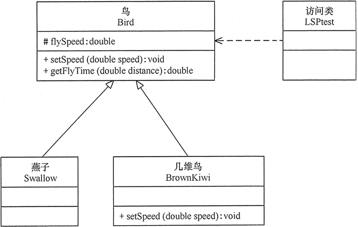

# 里氏替换原则——面向对象设计原则
[返回](../../README.md)

## 来源
>里氏替换原则（Liskov Substitution Principle，LSP）由麻省理工学院计算机科学实验室的里斯科夫（Liskov）女士在 1987 年的“面向对象技术的高峰会议”（OOPSLA）上发表的一篇文章[《数据抽象和层次》](document/DataAbstractionAndHierarchy.pdf)里提出来的，她提出：**继承必须确保超类所拥有的性质在子类中仍然成立**（Inheritance should ensure that any property proved about supertype objects also holds for subtype objects）。

## 含义
>里氏替换原则通俗来讲就是：**子类可以扩展父类的功能，但不能改变父类原有的功能**。也就是说：子类继承父类时，除添加新的方法完成新增功能外，**尽量不要重写父类的方法**。

>里氏替换原则定义一
>>**If for each object o1 of type S there is an object o2 of type T such that for all programs P defined in terms of T, the behavior of P is unchanged when o1 is substituted for o2 then S is a subtype of T.（如果对每一个类型为S的对象o1，都有类型为T的对象o2，使得以T定义的所有程序P在所有的对象o1都代替成o2时，程序P的行为没有发生变化，那么类型S是类型T的子类型。）**

>里氏替换原则定义二
>>**Functions that use pointers or references to base classes must be able to use objects of derived classes without knowing it.（所有引用基类的地方必须能透明地使用其子类的对象。）**

>只要父类能出现的地方子类就可以出现，而且替换为子类也不会产生任何错误或异常，使用者可能根本就不需要知道是父类还是子类。但是，反过来就不行了，**有子类出现的地方，父类未必就能适应**。

>关于里氏替换原则的例子，最有名的是“正方形不是长方形”。当然，生活中也有很多类似的例子，例如，企鹅、鸵鸟和几维鸟从生物学的角度来划分，它们属于鸟类；但从类的继承关系来看，由于它们不能继承“鸟”会飞的功能，所以它们不能定义成“鸟”的子类。同样，由于“气球鱼”不会游泳，所以不能定义成“鱼”的子类；“玩具炮”炸不了敌人，所以不能定义成“炮”的子类等。

## 作用
> 里氏替换原则主要阐述了有关继承的一些原则，也就是什么时候应该使用继承，什么时候不应该使用继承，以及其中蕴含的原理。里氏替换原是继承复用的基础，它反映了基类与子类之间的关系，是对开闭原则的补充，是对实现抽象化的具体步骤的规范。

> 里氏替换原则的主要作用如下。
1. 里氏替换原则是实现开闭原则的重要方式之一。
2. 它克服了继承中重写父类造成的可复用性变差的缺点。
3. 它是动作正确性的保证。即类的扩展不会给已有的系统引入新的错误，降低了代码出错的可能性。

> 继承优点
1. 代码共享，减少创建类的工作量，每个子类都拥有父类的方法和属性；
2. 提高代码的重用性；
3. 子类可以形似父类，但又异于父类；
4. 提高代码的可扩展性，实现父类的方法就可以“为所欲为”了;
5. 提高产品或项目的开放性。

> 继承缺点
1. 继承是侵入性的。只要继承，就必须拥有父类的所有属性和方法；
2. 降低代码的灵活性。子类必须拥有父类的属性和方法；
3. 增强了耦合性。当父类的常量、变量和方法被修改时，必需要考虑子类的修改，而且在缺乏规范的环境下，这种修改可能带来非常糟糕的结果
4. 大片的代码需要重构。

>如果通过重写父类的方法来完成新的功能，这样写起来虽然简单，但是整个继承体系的可复用性会比较差，特别是运用多态比较频繁时，程序运行出错的概率会非常大。
如果程序违背了里氏替换原则，则继承类的对象在基类出现的地方会出现运行错误。这时其修正方法是：取消原来的继承关系，重新设计它们之间的关系。

## 案例说明
>【例2】里氏替换原则在“几维鸟不是鸟”实例中的应用。

>分析：鸟一般都会飞行，如燕子的飞行速度大概是每小时 120 千米。但是新西兰的几维鸟由于翅膀退化无法飞行。假如要设计一个实例，计算这两种鸟飞行 300 千米要花费的时间。显然，拿燕子来测试这段代码，结果正确，能计算出所需要的时间；但拿几维鸟来测试，结果会发生“除零异常”或是“无穷大”，明显不符合预期，其类图如图所示。
  
[返回](../../README.md)